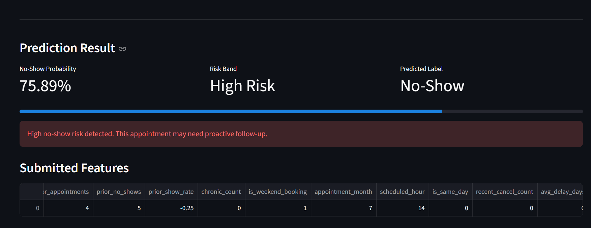
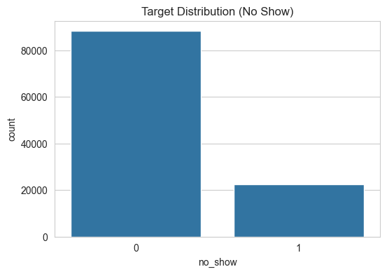
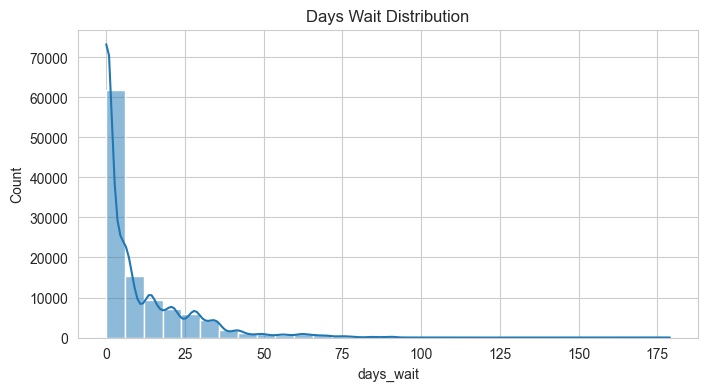
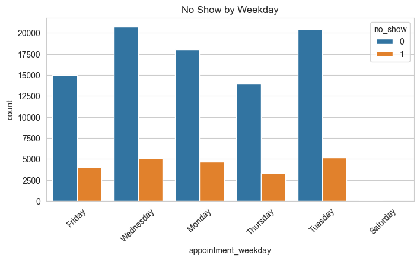
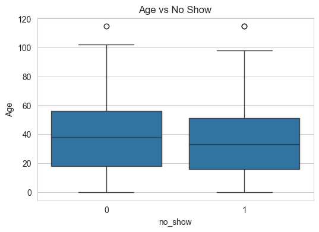

# 🏥 Hospital Appointment No-Show Prediction

[]()
[]()
[]()
[]()
[]()


# 🌐 Live Demo

Try the deployed application:

https://hospital-no-show-prediction-twlopy6eefkcagu65u93bv.streamlit.app/

Predict hospital appointment no-show risk using real-time patient and appointment information.

## 🔗 Quick Links

- Live Demo: https://hospital-no-show-prediction-twlopy6eefkcagu65u93bv.streamlit.app/
- Dataset: https://www.kaggle.com/datasets/joniarroba/noshowappointments

## 📌 Project Overview

Hospital appointment no-shows are a major challenge in healthcare systems worldwide. Missed appointments result in:

- Unused clinical resources
- Increased waiting times
- Reduced operational efficiency
- Financial losses for healthcare providers
- Delayed patient care

This project develops an **end-to-end Machine Learning pipeline** that predicts whether a patient is likely to miss a scheduled appointment before the appointment date.

# 📸 Project Screenshots

## Streamlit Prediction Dashboard



The dashboard allows healthcare staff to enter patient and appointment details and instantly receive:

- No-show probability
- Risk category (Low / Medium / High)
- Predicted outcome
- Feature summary

---

## Generated EDA Charts

### Target Distribution



### Waiting Time Distribution



### No-Show by Weekday



### Age vs No-Show



The solution includes:

- Data ingestion and preprocessing
- Exploratory Data Analysis (EDA)
- Feature engineering
- Temporal validation
- Machine Learning model training
- Model comparison
- Prediction pipeline
- Interactive Streamlit web application

---

# 🎯 Problem Statement

Given historical appointment records, predict whether a patient will:

- Attend the appointment (0)
- Miss the appointment / No-Show (1)

Early prediction allows healthcare providers to:

- Send additional reminders
- Reallocate resources
- Optimize scheduling
- Reduce operational costs

---

# 📊 Dataset

Dataset Source:

:contentReference[oaicite:0]{index=0}

### Dataset Statistics

| Metric | Value |
|----------|---------|
| Total Records | 110,527 |
| Features | 14 Original |
| Target Variable | No-show |
| Clean Records | 110,521 |
| Missing Values | None |
| Class Distribution | ~80% Show / ~20% No-Show |

---

# 🏗️ Project Architecture

```text
hospital-no-show-prediction/
│
├── data/
│   ├── raw/
│   └── processed/
│
├── models/
│   ├── best_model.joblib
│   └── model_metadata.json
│
├── outputs/
│   ├── target_distribution.png
│   ├── days_wait_distribution.png
│   ├── weekday_no_show.png
│   ├── age_vs_no_show.png
│   ├── metrics.json
│   └── sample_predictions.csv
│
├── src/
│   ├── config.py
│   ├── data_ingestion.py
│   ├── preprocessing.py
│   ├── feature_engineering.py
│   ├── eda.py
│   ├── train.py
│   └── predict.py
│
├── app.py
├── main.py
├── requirements.txt
└── README.md
```

---

# ⚙️ Workflow

```text
Raw Dataset
     │
     ▼
Data Cleaning
     │
     ▼
Feature Engineering
     │
     ▼
EDA
     │
     ▼
Temporal Train/Test Split
     │
     ▼
Model Training
     │
     ▼
Model Evaluation
     │
     ▼
Best Model Selection
     │
     ▼
Prediction Pipeline
     │
     ▼
Streamlit Deployment
```

---

# 🔍 Exploratory Data Analysis (EDA)

The project automatically generates visualizations:

### Generated Charts

- Target Distribution
- Waiting Time Distribution
- No-Show by Weekday
- Age vs No-Show

Saved inside:

```text
outputs/
```

### Example Insights

- Approximately 20% of appointments are missed.
- Longer waiting times increase no-show risk.
- Previous patient behavior strongly influences attendance.
- Appointment scheduling patterns affect outcomes.

---

# 🧠 Feature Engineering

Several predictive features were engineered to improve model performance.

### Time-Based Features

| Feature | Description |
|----------|------------|
| days_wait | Days between scheduling and appointment |
| scheduled_hour | Hour appointment was booked |
| appointment_month | Appointment month |
| is_same_day | Same-day appointment indicator |

### Patient History Features

| Feature | Description |
|----------|------------|
| prior_appointments | Previous appointments count |
| prior_no_shows | Previous missed appointments |
| prior_show_rate | Historical attendance rate |

### Health Features

| Feature | Description |
|----------|------------|
| chronic_count | Number of chronic conditions |

### Behavioral Features

| Feature | Description |
|----------|------------|
| SMS_received | Reminder SMS received |
| is_weekend_booking | Weekend booking flag |

### Demographic Features

| Feature | Description |
|----------|------------|
| Gender | Patient gender |
| Age | Patient age |
| age_group | Age category |
| Scholarship | Government assistance |

---

# 🤖 Machine Learning Models

Two baseline models were trained and compared.

## Logistic Regression

Advantages:

- Fast
- Interpretable
- Strong baseline

---

## Random Forest

Advantages:

- Handles nonlinear relationships
- Robust to outliers
- Better feature interactions

---

# 📈 Evaluation Metrics

The following metrics are used:

- Accuracy
- Precision
- Recall
- F1 Score
- ROC-AUC

### Current Results

| Model | Accuracy | Precision | Recall | F1 | ROC-AUC |
|---------|---------|----------|---------|---------|---------|
| Logistic Regression | 0.6580 | 0.3186 | 0.6095 | 0.4184 | 0.6885 |
| Random Forest | 0.5826 | 0.3058 | 0.8405 | 0.4485 | 0.7433 |

### Best Model

🏆 Random Forest

---

# 📦 Saved Artifacts

### Trained Model

```text
models/best_model.joblib
```

### Metadata

```text
models/model_metadata.json
```

### Sample Predictions

```text
outputs/sample_predictions.csv
```

---

# 🌐 Streamlit Web Application

The project includes an interactive Streamlit interface.

### Features

✅ Real-time predictions

✅ Probability scoring

✅ Risk categorization

✅ User-friendly interface

✅ Healthcare analytics dashboard

### Launch Locally

```
streamlit run app.py
```

---

# 🚀 Installation

## Clone Repository

```
git clone https://github.com/Praveen8279/hospital-no-show-prediction.git

cd hospital-no-show-prediction
```

---

## Install Dependencies

```
pip install -r requirements.txt
```

---

## Train Model

```
python main.py
```

---

## Generate Predictions

```
python -m src.predict
```

---

## Run Application

```
streamlit run app.py
```


---

# 🛠️ Tech Stack

### Programming Language

- Python

### Data Processing

- Pandas
- NumPy

### Visualization

- Matplotlib
- Seaborn

### Machine Learning

- Scikit-Learn

### Model Persistence

- Joblib

### Web Application

- Streamlit

### Version Control

- Git
- GitHub

---

# 🎓 Key Concepts Demonstrated

- Data Cleaning
- Data Validation
- Exploratory Data Analysis
- Feature Engineering
- Temporal Validation
- Class Imbalance Handling
- Machine Learning Pipelines
- Model Evaluation
- Model Serialization
- Interactive Deployment

---

# 📈 Future Improvements

### Model Improvements

- XGBoost
- LightGBM
- CatBoost
- Hyperparameter Optimization

### Explainability

- SHAP Analysis
- Feature Importance Dashboard

### Deployment

- Docker Containerization
- CI/CD Pipeline
- Cloud Deployment

### Data Enhancements

- External Healthcare Data
- Patient Demographics Expansion
- Appointment History Enrichment

---

# 💼 Resume Highlights

- Built an end-to-end healthcare machine learning system using a dataset containing over 110,000 hospital appointments.
- Engineered temporal and behavioral features including waiting time, appointment history, and attendance patterns.
- Developed a leakage-aware prediction pipeline with temporal validation and model comparison.
- Created an interactive Streamlit application for real-time no-show risk assessment.

---

# 👨‍💻 Author

**Praveen Singh**

B.Tech Computer Science Engineering

Machine Learning • Data Science • Software Development

---

# ⭐ If you found this project useful

Please consider giving the repository a star.